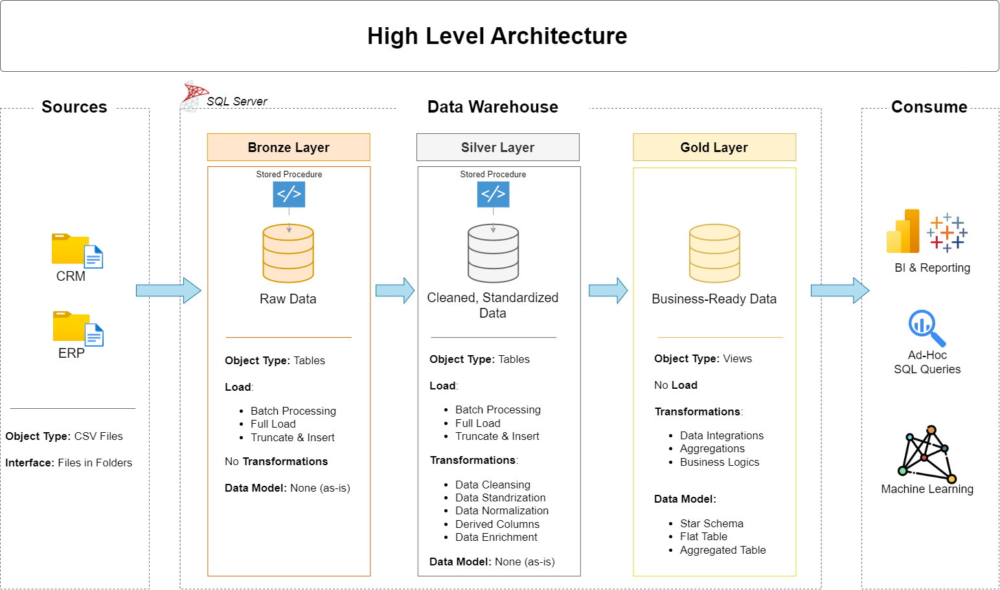
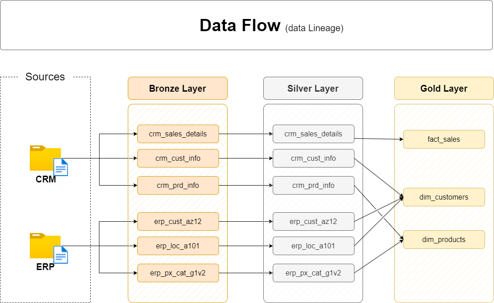
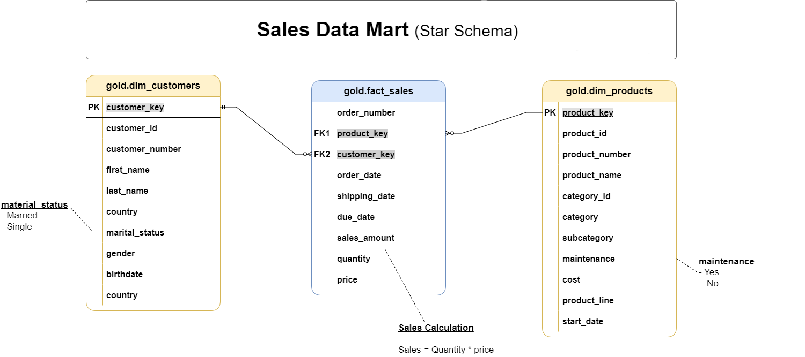
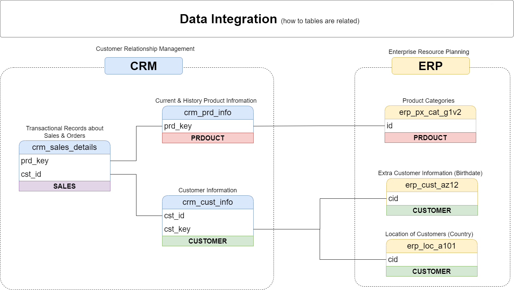
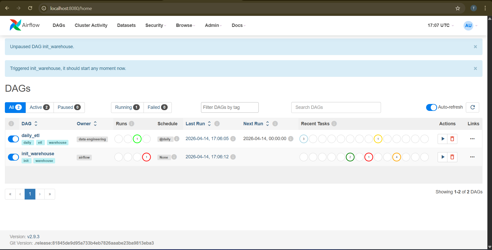
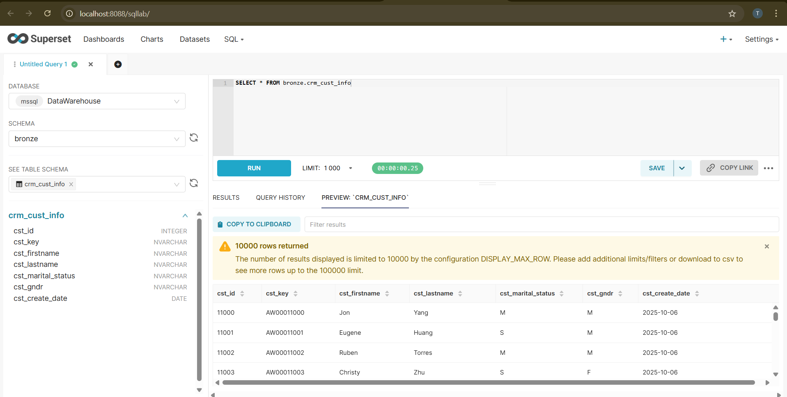
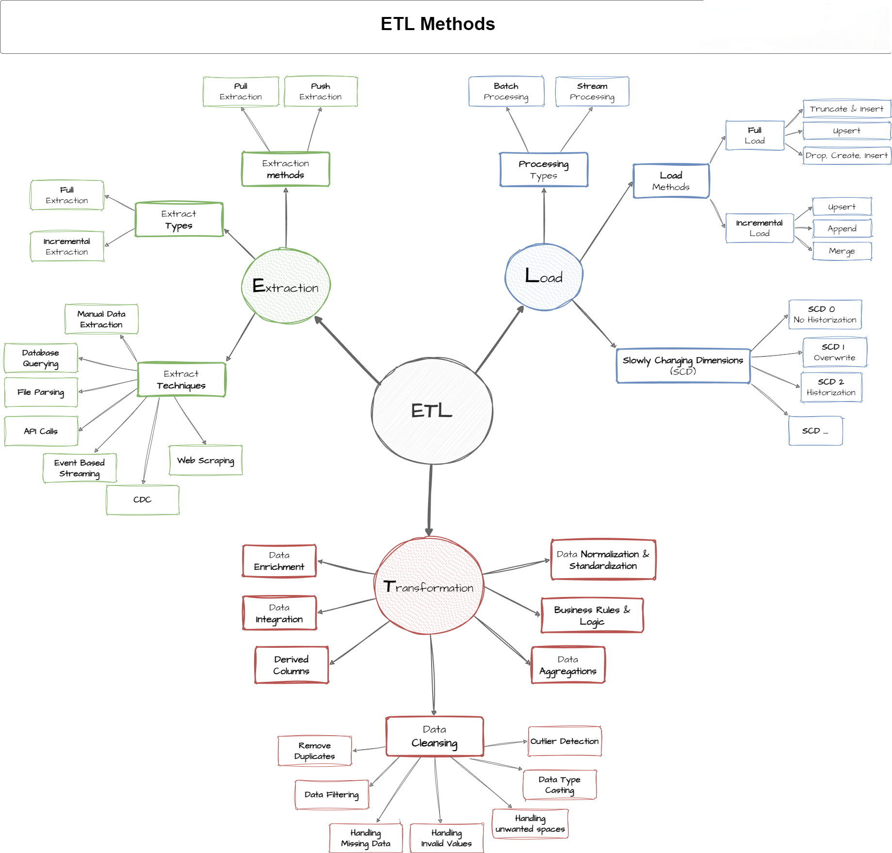

# SQL Data Warehouse Project

A fully containerised SQL Server data warehouse built using the **Medallion Architecture** (Bronze → Silver → Gold). Customer, product, and sales data from CRM and ERP source systems are ingested, cleansed, and modelled into a Kimball star schema — then scheduled with **Apache Airflow** and visualised through **Apache Superset**, all running in Docker.



---

## Table of Contents

1. [Architecture Overview](#architecture-overview)
2. [Data Model (Gold Layer)](#data-model-gold-layer)
3. [Data Sources](#data-sources)
4. [Project Structure](#project-structure)
5. [Key Transformations (Silver Layer)](#key-transformations-silver-layer)
6. [Data Quality Checks](#data-quality-checks)
7. [Getting Started](#getting-started)
8. [Orchestration with Apache Airflow](#orchestration-with-apache-airflow)
9. [Visualization with Apache Superset](#visualization-with-apache-superset)
10. [Querying the Warehouse](#querying-the-warehouse)
11. [Technologies](#technologies)
12. [Author](#author)
13. [License](#license)

---

## Architecture Overview

```
 CSV Files     ┌──────────┐     ┌──────────┐     ┌──────────┐     ┌──────────┐
  (CRM/ERP) ──▶│  Bronze   │────▶│  Silver   │────▶│   Gold   │────▶│ Superset │
               │ (Raw Data)│     │(Cleansed) │     │(Analytics)│     │(Dashboards)│
               └──────────┘     └──────────┘     └──────────┘     └──────────┘
                        ▲               ▲               ▲
                        └───── Apache Airflow (daily schedule) ─────┘
```

| Layer | Purpose | Implementation |
|-------|---------|----------------|
| **Bronze** | Raw data landing zone | `BULK INSERT` from CSV files — no transformations |
| **Silver** | Cleansed and standardised data | Stored procedures with deduplication, normalisation, validation |
| **Gold** | Business-ready analytics | Star schema views (dimensions + fact table) |



---

## Data Model (Gold Layer)

```
 ┌────────────────┐                              ┌────────────────┐
 │ dim_customers   │                              │ dim_products    │
 │────────────────│                              │────────────────│
 │ customer_key PK │◄──┐                    ┌──▶│ product_key  PK │
 │ customer_id     │   │                    │    │ product_id      │
 │ customer_number │   │                    │    │ product_number  │
 │ first_name      │   │                    │    │ product_name    │
 │ last_name       │   │  ┌──────────────┐  │    │ category_id     │
 │ country         │   │  │  fact_sales   │  │    │ category        │
 │ marital_status  │   │  │──────────────│  │    │ subcategory     │
 │ gender          │   └──│ customer_key  │  │    │ maintenance     │
 │ birthdate       │      │ product_key ──│──┘    │ cost            │
 │ create_date     │      │ order_number  │       │ product_line    │
 └────────────────┘      │ order_date    │       │ start_date      │
                          │ shipping_date │       └────────────────┘
                          │ due_date      │
                          │ sales_amount  │
                          │ quantity      │
                          │ price         │
                          └──────────────┘
```



### Row Counts (after full load)

| Table | Rows |
|-------|-----:|
| `gold.dim_customers` | 150 000 |
| `gold.dim_products` | 723 |
| `gold.fact_sales` | 1 002 701 |

---

## Data Sources

| Source | File | Description |
|--------|------|-------------|
| CRM | `cust_info.csv` | Customer master data |
| CRM | `prd_info.csv` | Product information with cost and product line |
| CRM | `sales_details.csv` | Sales transactions |
| ERP | `CUST_AZ12.csv` | Customer demographics (birthdate, gender) |
| ERP | `LOC_A101.csv` | Customer-to-country mapping |
| ERP | `PX_CAT_G1V2.csv` | Product categories and subcategories |

### Data Volume

| File | Rows | Size |
|------|-----:|-----:|
| `cust_info.csv` | 154 505 | 7 MB |
| `prd_info.csv` | 1 080 | 70 KB |
| `sales_details.csv` | 1 000 000 | 59 MB |
| `CUST_AZ12.csv` | 150 000 | 4 MB |
| `LOC_A101.csv` | 150 000 | 2.6 MB |
| `PX_CAT_G1V2.csv` | 37 | < 1 KB |



---

## Project Structure

```
sql-data-warehouse-project/
│
├── datasets/                        # Source CSV files
│   ├── source_crm/                  #   CRM system exports
│   │   ├── cust_info.csv
│   │   ├── prd_info.csv
│   │   └── sales_details.csv
│   └── source_erp/                  #   ERP system exports
│       ├── CUST_AZ12.csv
│       ├── LOC_A101.csv
│       └── PX_CAT_G1V2.csv
│
├── scripts/                         # SQL scripts (T-SQL)
│   ├── init_database.sql            #   Database & schema creation
│   ├── bronze/
│   │   ├── ddl_bronze.sql           #   Bronze table definitions
│   │   └── proc_load_bronze.sql     #   BULK INSERT stored procedure
│   ├── silver/
│   │   ├── ddl_silver.sql           #   Silver table definitions
│   │   └── proc_load_silver.sql     #   Cleansing stored procedure
│   └── gold/
│       └── ddl_gold.sql             #   Star schema views
│
├── tests/                           # Data quality checks
│   ├── quality_checks_silver.sql    #   Silver layer validations
│   └── quality_checks_gold.sql      #   Gold layer validations
│
├── dags/                            # Airflow DAGs (Python)
│   ├── dag_init_warehouse.py        #   One-time: create DB objects
│   ├── dag_daily_etl.py             #   Daily: bronze→silver→gold + QC
│   └── sql_quality_checks.py        #   Quality check runner module
│
├── superset/                        # Superset configuration
│   ├── datasources.yaml             #   Auto-registered SQL Server connection
│   └── bootstrap_dashboard.py       #   Script to create charts & dashboard
│
├── docs/                            # Documentation & diagrams
│   ├── data_catalog.md
│   ├── naming_conventions.md
│   ├── data_architecture.png
│   ├── data_flow.png
│   ├── data_integration.png
│   ├── data_model.png
│   ├── ETL.png
│   ├── Airflow.png
│   └── Superset.png
│
├── plugins/                         # Airflow plugins (empty)
├── logs/                            # Airflow logs (git-ignored)
├── docker-compose.yml               # Full stack definition
├── Dockerfile                       # Custom Airflow image
├── .env                             # Environment variables
├── .gitignore
├── start.sh                         # Convenience start script (Linux/WSL)
└── README.md
```

---

## Key Transformations (Silver Layer)

| Transformation | Details |
|----------------|---------|
| **Deduplication** | Window functions (`ROW_NUMBER`) to keep most recent records |
| **Gender normalisation** | `M`/`F` → `Male`/`Female`, CRM takes priority over ERP |
| **Marital status** | `S`/`M` → `Single`/`Married` |
| **Product line expansion** | `M`/`R`/`S`/`T` → `Mountain`/`Road`/`Other Sales`/`Touring` |
| **Date conversion** | Integer `YYYYMMDD` → proper `DATE` type |
| **Country code mapping** | `DE`/`US`/`AU`/etc. → full country names |
| **Data validation** | Future birthdates set to `NULL`, sales recalculated where inconsistent |
| **Sales correction** | Two-pass subquery: derive price first, then recalculate sales from corrected price. Rows where both `sales` and `price` are irrecoverable (NULL/negative) are excluded |
| **ID cleanup** | `NAS` prefix stripped from ERP customer IDs |

---

## Data Quality Checks

Automated checks run as part of the daily ETL pipeline. Any failure stops the pipeline.

| Layer | # Checks | Validations |
|-------|:--------:|-------------|
| **Silver** | 10 | Null/duplicate primary keys, untrimmed whitespace, negative costs, date ordering, sales formula integrity (`sales = qty × price`), birthdate range |
| **Gold** | 3 | Surrogate key uniqueness across dimensions, orphaned foreign keys in `fact_sales` |

---

## Getting Started

### Prerequisites

- **Docker Desktop** (Windows/Mac) or Docker Engine (Linux)
- **Git** (to clone the repo)
- ~4 GB free RAM for the containers (SQL Server alone requires 2 GB)

### Quick Start

```bash
# 1. Clone the repository
git clone https://github.com/ThanyaniMulelu/sql-data-warehouse-project.git
cd sql-data-warehouse-project

# 2. Start all services
docker compose up -d --build

# 3. Wait for services to be healthy (~60 seconds)
docker compose ps
```

This spins up **6 containers**:

| Service | Port | Purpose |
|---------|------|---------|
| **mssql** | `localhost:1433` | SQL Server 2022 (data warehouse) |
| **postgres** | internal | Airflow metadata database |
| **airflow-webserver** | `localhost:8080` | Airflow UI |
| **airflow-scheduler** | internal | DAG executor |
| **airflow-init** | — | One-shot DB migration + admin user creation |
| **superset** | `localhost:8088` | BI dashboards |

### Initialise the Warehouse

1. Open the **Airflow UI** at [http://localhost:8080](http://localhost:8080)
   - Username: `airflow` / Password: `airflow`
2. Trigger the **`init_warehouse`** DAG (click ▶ play button)
   - Creates the database, schemas, tables, stored procedures, and gold views
3. Once it completes (all green), trigger the **`daily_etl`** DAG
   - Loads data: `bronze.load_bronze` → `silver.load_silver` → quality checks
4. The `daily_etl` DAG will run automatically every day going forward



### Bootstrap the Dashboard

```bash
docker exec sql-data-warehouse-project-superset-1 \
  python /app/docker/superset/bootstrap_dashboard.py
```

Then open [http://localhost:8088/superset/dashboard/1/](http://localhost:8088/superset/dashboard/1/)
- Username: `admin` / Password: `admin`



### Stopping & Restarting

```bash
# Stop all containers (data is preserved in Docker volumes)
docker compose down

# Stop and delete all data (fresh start)
docker compose down -v
```

---

## Orchestration with Apache Airflow

The project includes two DAGs:

### `init_warehouse` (Manual, one-time)

Runs the SQL scripts in sequence to build the database from scratch:

```
create_database → create_schemas → create_bronze_tables → create_bronze_proc
    → create_silver_tables → create_silver_proc → create_gold_views
```

### `daily_etl` (Scheduled, `@daily`)

Runs the full ETL pipeline and quality gates:

```
load_bronze → load_silver → quality_checks_silver → quality_checks_gold
```

- Uses **`pymssql`** for direct SQL Server connectivity (no Airflow provider needed)
- Quality check failures **stop the pipeline** via `AirflowFailException`
- All SQL execution uses `autocommit=True` for DDL compatibility



---

## Visualization with Apache Superset

Superset is pre-configured with:
- A **DataWarehouse** database connection pointing to SQL Server
- **7 datasets** built from gold layer queries
- **6 charts** on a published dashboard

| Chart | Type | Shows |
|-------|------|-------|
| Total Revenue by Country | Bar | Sales breakdown per country |
| Monthly Revenue Trend | Line | Revenue over time |
| Top 15 Products | Bar | Highest-grossing products |
| Customer Gender Split | Pie | Male / Female / n/a distribution |
| Revenue by Category | Treemap | Category + subcategory revenue |
| Customers per Country | Donut | Customer geographic distribution |

You can also use **SQL Lab** ([http://localhost:8088/sqllab/](http://localhost:8088/sqllab/)) to run ad-hoc queries against any layer of the warehouse.

---

## Querying the Warehouse

### Option 1: VS Code MSSQL Extension

1. Install the **SQL Server (mssql)** extension in VS Code
2. Add a connection:
   - Server: `localhost,1433`
   - Database: `DataWarehouse`
   - Authentication: SQL Login
   - User: `sa` / Password: `YourStrong!Passw0rd123`

### Option 2: Any SQL Client (SSMS, Azure Data Studio, DBeaver)

```
Server:   localhost,1433
Database: DataWarehouse
User:     sa
Password: YourStrong!Passw0rd123
```

### Sample Queries

```sql
-- Revenue by country
SELECT c.country, SUM(f.sales_amount) AS total_revenue
FROM gold.fact_sales f
JOIN gold.dim_customers c ON f.customer_key = c.customer_key
GROUP BY c.country
ORDER BY total_revenue DESC;

-- Top 10 products by units sold
SELECT TOP 10 p.product_name, SUM(f.quantity) AS units_sold
FROM gold.fact_sales f
JOIN gold.dim_products p ON f.product_key = p.product_key
GROUP BY p.product_name
ORDER BY units_sold DESC;

-- Monthly sales trend
SELECT FORMAT(order_date, 'yyyy-MM') AS month,
       COUNT(*) AS orders, SUM(sales_amount) AS revenue
FROM gold.fact_sales
WHERE order_date IS NOT NULL
GROUP BY FORMAT(order_date, 'yyyy-MM')
ORDER BY month;
```

---

## Technologies

| Category | Technology |
|----------|-----------|
| **Database** | SQL Server 2022 (T-SQL) |
| **Architecture** | Medallion (Bronze / Silver / Gold) |
| **Data Modelling** | Star Schema (Kimball methodology) |
| **Orchestration** | Apache Airflow 2.9 with Python 3.11 |
| **Visualization** | Apache Superset 3.1 |
| **Containerisation** | Docker & Docker Compose |
| **Connectivity** | pymssql (FreeTDS) |
| **SQL Techniques** | `BULK INSERT`, window functions, CTEs, `TRY-CATCH`, stored procedures, views |

---

## Author

**Thanyani Selby Mulelu**  
GitHub: [@ThanyaniMulelu](https://github.com/ThanyaniMulelu)

---

## License

This project is open source and available for learning and educational purposes.
